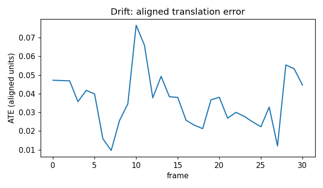
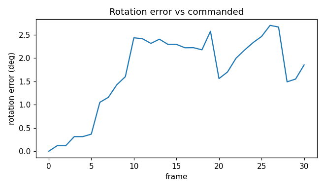
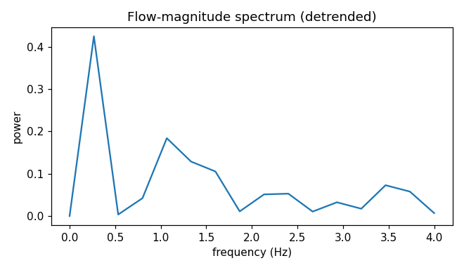
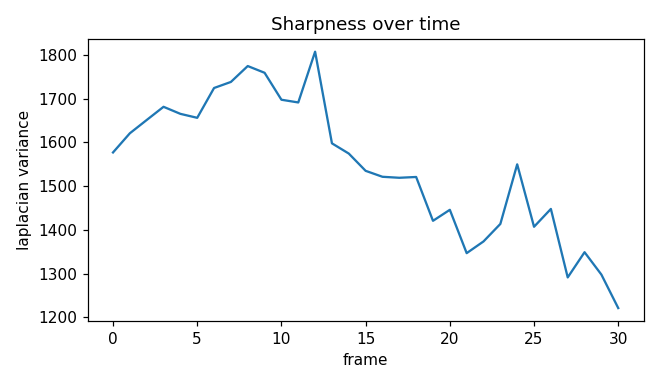

# wmdrift report: synthetic_pan.mp4

- video: `tests\fixtures\synthetic_pan.mp4`
- frames: 31, fps: 8.00
- commanded pose: `w*30`

## Camera drift

VO recovered the trajectory and was Sim(3)-aligned to the
commanded one. Fitted scale factor: **0.0843**. 
Monocular VO cannot recover metric scale, so this factor is
the recovered/commanded unit ratio, not an error (see minWM
issue #18 on camera translation scale).

- ATE mean: 0.0363
- ATE max: 0.0766
- ATE final frame: 0.0447
- rotation error mean: 1.69 deg
- rotation error max: 2.70 deg

## Temporal jitter

Jitter score (spectral power above fs/4 over total power, linear trend removed): **0.2514**

High-frequency RMS of the detrended flow-magnitude series (flow units): **0.0259**. The ratio alone barely separates a clean dolly from a jittered one -- a nearly flat residual still has a moderate ratio -- so this amplitude is the number I actually compare between runs.

## Quality decay

Sharpness = per-frame Laplacian variance (a noisy no-reference
proxy, not a perceptual metric).

- decay slope: -14.5969 per frame
- fit r: -0.835
- collapse heuristic fires at frame 15 (sharpness below 1568.1)

## Memory (loop closure)

Commanded trajectory does not return to the start (and --force-loop was not given), so there is nothing to close.

## Limitations

Monocular VO gives trajectory shape, not metric truth: ATE is
reported after Sim(3) alignment, so it measures consistency with
the commanded path up to a global scale. Laplacian variance is a
crude quality proxy. The loop-closure check assumes the renderer
and the model see the same scene at the same viewpoint. Numbers on
synthetic fixtures say more about the pipeline than about any model.
